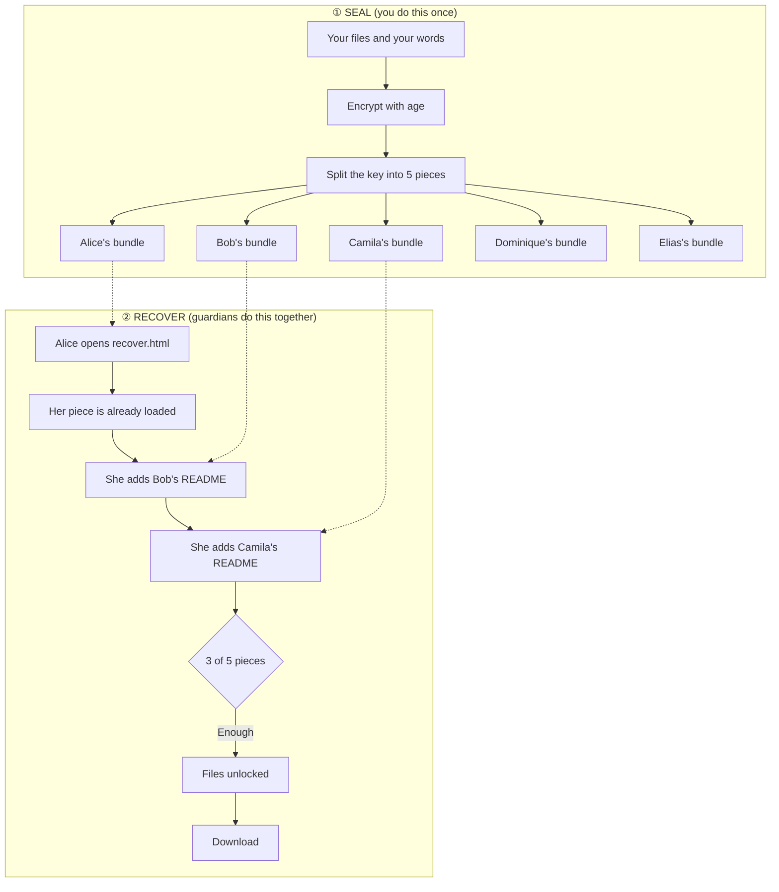

# Bitcoin Inheritance

**Your heirs will inherit your keys. They will not inherit what you know about them.**

<sub>Built by Bitcoin Butlers. A modified derivative of
[Rememory](https://github.com/eljojo/rememory), Apache-2.0. See [NOTICE](NOTICE).</sub>

A hardware wallet in a drawer is not a plan. Neither is a seed phrase on steel.
Both survive you. What dies with you is everything around them: which wallet
this is, how many keys it takes, which software opens it, where the other keys
live, and who to call first.

This tool takes what you know, encrypts it, and splits the key among people you
trust. No one of them can open it. Enough of them together can.

**It is free, it runs in your browser, and nothing you type reaches us.**

- **Create Bundles** — <https://www.bitcoinbutlers.com/tools/inheritance/maker.html>
- **Recover** — <https://www.bitcoinbutlers.com/tools/inheritance/recover.html>
- **The guide** — <https://www.bitcoinbutlers.com/tools/inheritance/docs.html>

---

## What a guardian can and cannot see

This is the part that makes it different, so it goes first.

A guardian holds one bundle. Opening it, alone, they see **their own piece and
their own name**. That is all.

They do not see who the other guardians are. They do not see how your wallet
works. They do not see where a key is kept. A bundle is built to be forwarded,
so it carries nothing that would help the person it is forwarded to.

Everything you write is sealed inside the encrypted archive and opens only when
enough guardians come together:

| Sealed file | What you wrote |
|---|---|
| `HOW-THE-WALLET-WORKS.txt` | how it opens, how many keys, which software |
| `WHERE-THE-KEYS-ARE.txt` | where each key is kept |
| `CHAIN-COPY.txt` | the chain copy and its transaction id, if you made one |

**Who holds a piece belongs in your will**, not in the thing they are holding.
Two guardians who know each other can agree between themselves. Two guardians
who do not, cannot.

---

## Recovery works without this project

Each guardian receives a bundle containing `recover.html`, a recovery tool that
runs in any browser. No servers. No dependencies. Nothing of ours has to exist
when recovery happens.

Run `make demo` to build a set and try a recovery yourself.



Any 3 pieces rebuild the key. A single piece reveals nothing: not "very
little", mathematically zero.

The number of guardians and the threshold are yours. 2 of 3 for a small
circle, 3 of 5 for a wider one, 2 of 2 for a couple.

---

## How to use it

**Open [Create Bundles](https://www.bitcoinbutlers.com/tools/inheritance/maker.html) and work down the page.**

1. **Guardians.** Name each person and set how many must agree. Their names
   stay on your machine. No bundle carries them.
2. **Files.** Drag in what your heirs need: a wallet descriptor, a letter, a
   list of accounts. **Never seed words.** A bundle that holds your seed is a
   copy of your wallet.
3. **Your words.** The page asks what your heirs need to know, in two parts:
   how the wallet works, and where the keys are. Answer in your own words.
   Both are sealed.
4. **Generate**, then give each guardian their bundle.

Then write the guardian list on one page and keep it with your will. That page
is how your heirs find them, and it is the only copy.

### Putting the descriptor on Bitcoin

A multisig wallet needs its descriptor as well as its keys. Lose one key and
the descriptor together, and the keys you still hold cannot rebuild the
wallet, even when they are enough to sign.

Choose "Bundles and the chain" in step 3 and paste your descriptor. The page
encrypts it so that only your own keys open it, and hands you one line of text
for a single `OP_RETURN` output. **Publish it before you generate**, then paste
the transaction id back into the page: the archive is sealed when you generate,
so an id found afterwards can never get in.

Write that transaction id on your estate page too. It is what an heir uses when
they cannot gather enough guardians.

---

## What is in a bundle

| File | What it is |
|---|---|
| `README.txt`, `README.pdf` | what this is, their piece, and where to look for the others |
| `recover.html` | the recovery tool. For archives of 10 MB or less, the encrypted data is inside it |
| `MANIFEST.age` | the encrypted archive, separate only when it is large |
| `METADATA.yaml` | what the bundle is, in plain text. Command line only |
| `OWNER.age` | optional. Lets you recover alone with your own key |

---

## What this does not protect against

- **A guardian who loses their bundle.** That is why the threshold is below the
  total. Run a drill once a year.
- **Old bundles.** Regenerating makes a brand new key. An old piece and a new
  piece cannot be combined, and nothing on the outside of a bundle shows it.
  When you hand out new bundles, say plainly: delete the old one.
- **Seed words you put in anyway.** The tool asks you not to. It cannot stop
  you.
- **A compromised machine.** The bundles are made on yours.

---

## Build it

Build from this repository.

```bash
npm install && make build      # needs Go and Node
./inheritance --help

make test                      # Go tests
make test-e2e                  # browser tests
make html                      # the static pages, into dist/
```

Self-hosting a recovery server is in [docs/selfhosted.md](docs/selfhosted.md).

---

## The service

The tool is free and always will be. Bitcoin Butlers sells the time around it:
a guided placement session, an annual drill, and putting a descriptor on the
chain. A Butler never holds a bundle, a piece, a key or a file, and the client
does everything on their own machine.

<https://www.bitcoinbutlers.com/tools/inheritance>

---

## License

Apache-2.0. Copyright 2026 Bitcoin Butlers, with portions copyright José Tomás
Albornoz and the Rememory contributors. See [NOTICE](NOTICE).

Built on [age](https://github.com/FiloSottile/age) and
[typage](https://github.com/FiloSottile/typage) by Filippo Valsorda,
[HashiCorp Vault's Shamir implementation](https://github.com/hashicorp/vault/blob/main/shamir/shamir.go),
[shamir-secret-sharing](https://github.com/privy-io/shamir-secret-sharing) by Privy,
[fflate](https://github.com/101arrowz/fflate),
[tarparser](https://github.com/highercomve/tarparser),
[tlock](https://github.com/drand/tlock) and
[Cobra](https://github.com/spf13/cobra).
